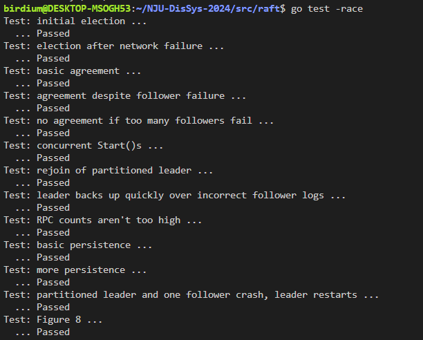

# 分布式系统作业二实验报告

在本次实验中，我使用 golang 实现了 raft 协议，包括节点选举，日志追加，持久化等内容。代码通过了 Part 1, 2, 3 要求的全部测试。

## 常量与结构体定义

raft 中节点的三种状态：

```golang
const (
    FOLLOWER = iota 
    CANDIDATE
    LEADER
)
```

时间常量：选举超时间隔为 150-300ms，心跳间隔为 100ms

```golang
const (
    HEARTBEAT_INTERVAL   = 100
    ELECTION_TIMEOUT_MIN = 150
    ELECTION_TIMEOUT_MAX = 300
)

func getRandElectionTimeout() time.Duration {
	return time.Duration(rand.Intn(ELECTION_TIMEOUT_MAX - ELECTION_TIMEOUT_MIN) + ELECTION_TIMEOUT_MIN) * time.Millisecond
}

func getHeartbeatTimeout() time.Duration {
	return HEARTBEAT_INTERVAL * time.Millisecond
}
```

LogEntry 结构体存储日志相关信息

```golang
type LogEntry struct {
	Command interface{}
	Term	int
}
```

Raft 结构体定义：

```golang
// A Go object implementing a single Raft peer.
type Raft struct {
	mu        sync.Mutex          // Lock to protect shared access to this peer's state
	peers     []*labrpc.ClientEnd // RPC end points of all peers
	persister *Persister          // Object to hold this peer's persisted state
	me        int                 // this peer's index into peers[]
	dead      int32               // set by Kill()

	// Your data here.
	// Look at the paper's Figure 2 for a description of what
	// state a Raft server must maintain.
	
	// persistent fields
	currentTerm int
	votedFor    int
	log         []LogEntry

	// volatile fields
	commitIndex int
	lastApplied int

	// leader's volatile fields
	nextIndex   []int
	matchIndex  []int

	// 节点的状态（FOLLOWER, CANDIDATE, LEADER）
	role int

	// 定时器 Timers
	electionTimer 	*time.Timer // 选举计时器
	heartbeatTimer 	*time.Timer // 心跳计时器

	// 日志 Apply Channel
	applyCh 	chan ApplyMsg
}
```

RequestVote 和 AppendEntries 结构体，基本复制了论文中的设定。

```golang
type RequestVoteArgs struct {
	Term         int
	CandidateId  int
	LastLogIndex int
	LastLogTerm  int
}

type RequestVoteReply struct {
	Term        int
	VoteGranted bool
}

type AppendEntriesArgs struct {
	Term         int
	LeaderId     int
	PrevLogIndex int
	PrevLogTerm  int
	Entries      []LogEntry
	LeaderCommit int
}

type AppendEntriesReply struct {
	Term    int
	Success bool
}
```

ApplyMsg，通过 apply channel 发送被 apply 的 log。

```golang
type ApplyMsg struct {
	Index       int
	Command     interface{}
	UseSnapshot bool   // ignore for lab2; only used in lab3
	Snapshot    []byte // ignore for lab2; only used in lab3
}
```

## 第一部分

第一部分的内容主要包含节点选举与心跳机制。

首先，每个节点被 `Make()` 函数创建，在这里，各种字段将会被初始化，包括两个计时器。

```golang
func Make(peers []*labrpc.ClientEnd, me int,
	persister *Persister, applyCh chan ApplyMsg) *Raft {
	rf := &Raft{}
	rf.peers = peers
	rf.persister = persister
	rf.me = me
	
	// Your initialization code here.
	
	// initialize basic information
	rf.role = FOLLOWER
	rf.currentTerm = 0
	rf.votedFor = -1
	rf.dead = 0
	rf.applyCh = applyCh
	rf.log = []LogEntry{{Term: 0}} // null log

	// initialize timer
	rf.electionTimer = time.NewTimer(getRandElectionTimeout())
	rf.heartbeatTimer = time.NewTimer(getHeartbeatTimeout())

	// initialize from state persisted before a crash
	rf.readPersist(persister.ReadRaftState())

	// start ticker goroutine to start elections
	go rf.ticker()
	go rf.applyLoop()

	return rf
}
```

每个节点被初始化成 FOLLOWER，初始化选举与心跳时钟，并且启动两个 goroutine

我们需要关注的是 `ticker()` 函数，这个函数包含了选举与心跳计时器的响应逻辑。

```golang
func (rf *Raft) ticker() {
	for !rf.killed() {
		select {
		case <- rf.electionTimer.C:
			rf.resetElectionTimer()
			// election timeout, start election
			rf.mu.Lock()
			if rf.role == LEADER {
				// debug print
				rf.mu.Unlock()
				continue
			}
			DPrintf("Node %v election timeout", rf.me)
			rf.startElection()
			rf.mu.Unlock()
		case <- rf.heartbeatTimer.C:
			// heartbeat timeout, send heart beat
			rf.mu.Lock()
			if rf.role == LEADER {
				rf.sendHeartbeats()
				rf.resetHeartbeatTimer()
			}
			rf.mu.Unlock()
		}
	}
}
```

简单来说，对于选举计时器超时的非leader节点，调用 `startElection()`，尝试竞选。对于心跳计时器超时的leader节点，调用`sendHeartbeats` 发送心跳。

在 `startElection()` 中，节点转换为 CANDIDATE，投给自己，并且重设选举计时器。

```golang
func (rf *Raft) startElection() {
	rf.role = CANDIDATE
	rf.currentTerm += 1
	rf.votedFor = rf.me
	rf.resetElectionTimer()

	rf.persist()

	DPrintf("Node %v has become a candidate with term %v!", rf.me, rf.currentTerm)

	args := rf.getRequestVoteArgs()

	npeer := len(rf.peers)

	voteCh := make(chan RequestVoteReply, npeer)

	for peer := range rf.peers {
		if peer == rf.me {
			continue
		}
		// start a goroutine that sends RequestVote RPC to peer
		// vote result will be transferred via channel voteCh 
		go func(peer int) {
			reply := RequestVoteReply{}
			rf.sendRequestVote(peer, args, &reply)
			voteCh <- reply
		} (peer)
	}

	go rf.collectVote(voteCh, npeer)
}

func (rf *Raft) collectVote(voteCh chan RequestVoteReply, npeer int) {
	voteTot := 1
	voteCnt := 1

	// loop that counts the result
	for {
		vote := <-voteCh
		voteTot += 1
		if vote.VoteGranted {
			voteCnt += 1
		} else {
			rf.mu.Lock()
			if rf.role != CANDIDATE {
				rf.mu.Unlock()
				break
			}
			if vote.Term > rf.currentTerm {
				rf.currentTerm = vote.Term
				rf.role = FOLLOWER
				rf.votedFor = -1
				rf.persist()
				rf.resetElectionTimer()
				voteCnt = 0
				rf.mu.Unlock()
				break
			}
			rf.mu.Unlock()
		}
		if voteTot == npeer || voteCnt > npeer/2 || voteTot-voteCnt > npeer/2 {
			break
		}
	}

	if voteCnt > npeer/2 {
		rf.becomeLeader()
	}
}
```

在我的实现中，CANDIDATE 为每个 peer 创建一个 goroutine，通过 RPC 调用来发送 RequestVote请求。同时 CANDIDATE 创建一个用于统计投票情况的 goroutine，当满足条件时，它会变为 leader。如果它收到了

从 RequestVote 接收方看，会进行如下操作：

```golang
// RequestVote RPC handler.
func (rf *Raft) RequestVote(args RequestVoteArgs, reply *RequestVoteReply) {
	rf.mu.Lock()
	defer rf.mu.Unlock()

	reply.VoteGranted = false
	reply.Term = rf.currentTerm

	if args.Term < rf.currentTerm {
		return
	}

	if args.Term > rf.currentTerm {
		rf.role = FOLLOWER
		rf.currentTerm = args.Term
		rf.votedFor = -1
		doPersist = true
	}
	
	if rf.votedFor == -1 || rf.votedFor == args.CandidateId {
		rf.currentTerm = args.Term
		reply.Term = rf.currentTerm
		reply.VoteGranted = true
		rf.votedFor = args.CandidateId
		doPersist = true
	}
	
	if (rf.votedFor == args.CandidateId) {
		rf.resetElectionTimer()
	} 
}
```

当接收方收到的 Term 比 currentTerm 小的时候，拒绝投票并返回自己的 Term。
当接收方收到的 Term 更大时，将自己转换为 FOLLOWER并取消当前的投票状态。如果此时没有投给其他人，则投给请求者。

对于成功当选的节点，需要首先调用 `becomeLeader` 进行初始化：

```golang
func (rf *Raft) becomeLeader() {
	rf.mu.Lock()
	defer rf.mu.Unlock()

    DPrintf("Node %v becomes a leader", rf.me)

	rf.role = LEADER
	rf.resetElectionTimer()
	rf.heartbeatTimer.Reset(0)

	npeer := len(rf.peers)
	nlog := len(rf.log) 

	rf.nextIndex = make([]int, npeer)
	rf.matchIndex = make([]int, npeer)

	for i := range rf.peers {
		rf.nextIndex[i] = nlog
		rf.matchIndex[i] = 0
	}

	rf.nextIndex[rf.me] = nlog - 1

	rf.persist()

}
```

leader 会立刻将心跳间隔设为0，从而启动心跳机制。

心跳机制由 `ticker()` 中计时器触发，会调用 `sendHeartbeats()` 函数：

```golang
func (rf *Raft) sendHeartbeats() {
	nlog := len(rf.log)

	rf.nextIndex[rf.me] = nlog + 1
	rf.matchIndex[rf.me] = nlog

	for peer := range rf.peers {
		if peer == rf.me {
			continue
		}
		go rf.sendAppendEntriesToPeer(peer)
	}
}
```

这里和 `requestVote` 的发送类似，都是创建一个 goroutine。区别在于这里没有单开一个线程来统计结果。

`sendAppendEntriesToPeer()` 的实现在第一阶段中比较简单，只需要发送空 log 即可。

```golang
func (rf *Raft) getAppendEntriesArgs(slave int) AppendEntriesArgs {
	args := AppendEntriesArgs{
		Term:         rf.currentTerm,
		LeaderId:     rf.me,
	}
	return args
}

func (rf *Raft) sendAppendEntriesToPeer(peer int) {
	args := rf.getAppendEntriesArgs(peer)

	reply := AppendEntriesReply{}
	ok := rf.sendAppendEntries(peer, args, &reply)

	if ok {
		rf.mu.Lock()
		defer rf.mu.Unlock()
		// received higher term reply, switch into follower
		if reply.Term > rf.currentTerm { 
			rf.role = FOLLOWER
			rf.currentTerm = reply.Term
			rf.resetElectionTimer()
			return 
		}
		
	} 
}
```

AppendEntries 接受方收到心跳后，若满足条件则重置选举间隔：

```golang
// Append Entries RPC handler.
func (rf *Raft) AppendEntries(args AppendEntriesArgs, reply *AppendEntriesReply) {
	// TODO: phase 2B
	rf.mu.Lock()
	defer rf.mu.Unlock()

	DPrintf("Node %v Term %v receives a heartbeat from Node %v Term %v", rf.me, rf.currentTerm, args.LeaderId, args.Term)
	
	if args.Term < rf.currentTerm {
		reply.Term, reply.Success = rf.currentTerm, false
		return
	}

	if args.Term > rf.currentTerm {
		rf.currentTerm, rf.votedFor = args.Term, -1
	}
	
	if rf.role != FOLLOWER {
		DPrintf("Node %v has become a follower with term %v!", rf.me, args.Term)
	}

	rf.role = FOLLOWER
	

	rf.resetElectionTimer()
}
```

第一阶段的内容到此为止。这一阶段难点主要在于框架的搭建，和计时器的设置。我这里选取了 `time.Timer`，实际上这中间有[很多坑](https://antonz.org/timer-reset/)，完全正确使用是有些难度的。

## 第二部分

第二部分的内容是日志追加，主要需要修改的部分是 `AppendEntries` 相关的内容。

首先，修改 `Start()` 函数，这个函数用来给 client 调用，来向 leader 的 log 中添加 command。

```golang
func (rf *Raft) Start(command interface{}) (int, int, bool) {
	rf.mu.Lock()
	defer rf.mu.Unlock()

	isLeader := rf.role == LEADER

	if !isLeader || rf.killed() {
		return -1, -1, false
	}

	index := len(rf.log)
	term := rf.currentTerm
	rf.log = append(rf.log, LogEntry{Term: term, Command: command})
	// rf.persist()

	return index, term, true
}
```

Leader 在第二阶段不能单纯发送空的 heartbeat 包了，我们改写 `sendAppendEntriesToPeer()`，来实现日志追加：

```golang
func (rf *Raft) sendAppendEntriesToPeer(peer int) {

	rf.mu.Lock()
	args := rf.getAppendEntriesArgs(peer)
	rf.mu.Unlock()

	reply := AppendEntriesReply{}
	ok := rf.sendAppendEntries(peer, args, &reply)

	if ok {
		rf.mu.Lock()
		defer rf.mu.Unlock()
		// received higher term reply, switch into follower
		if reply.Term > rf.currentTerm { 
			rf.role = FOLLOWER
			rf.currentTerm = reply.Term
			rf.resetElectionTimer()
			return 
		}
		
		if reply.Success {
			rf.matchIndex[peer] = args.PrevLogIndex + len(args.Entries)
			rf.nextIndex[peer] = rf.matchIndex[peer] + 1
			majorityIndex := getMajorityMatchIndex(rf.matchIndex)
			if rf.log[majorityIndex].Term == rf.currentTerm && majorityIndex > rf.commitIndex {
				rf.commitIndex = majorityIndex
			}
		} else {
			rf.nextIndex[peer] -= 1
		}
	} 
}
```

leader 在发送AppendEntries前，需要选择是否携带 log，或者发送空的心跳包。其中 `getAppendEntriesArgs()` 通过比对 nextIndex[slave] 和 lastLogIndex，获取发送给 `peer` 的正确参数。

```golang
func (rf *Raft) getAppendLogs(peer int) (prevLogIndex int, prevLogTerm int, entries []LogEntry) {

	nextIndex := rf.nextIndex[peer]
	lastLogIndex, lastLogTerm := rf.getLastLogIndexTerm()

	if nextIndex <= 0 || nextIndex > lastLogIndex { // heartbeat only
		prevLogIndex = lastLogIndex
		prevLogTerm = lastLogTerm
		return
	}

	entries = append([]LogEntry{}, rf.log[nextIndex:]...)
	prevLogIndex = nextIndex - 1
	if prevLogIndex == 0 {
		prevLogTerm = 0
	} else {
		prevLogTerm = rf.log[prevLogIndex].Term
	}
	return
}

func (rf *Raft) getAppendEntriesArgs(peer int) AppendEntriesArgs {
	prevLogIndex, preLogTerm, entries := rf.getAppendLogs(peer)
	args := AppendEntriesArgs{
		Term:         rf.currentTerm,
		LeaderId:     rf.me,
		PrevLogIndex: prevLogIndex,
		PrevLogTerm:  preLogTerm,
		Entries:      entries,
		LeaderCommit: rf.commitIndex,
	}
	return args
}
```

leader 收到 reply 后，如果成功，更新 `matchIndex` 和 `nextIndex`，调用 `getMajorityIndex()` 判断哪些 log 已经被过半节点接收，可以被 commit，更新。如果失败，将 `nextIndex` 减一，下次发送心跳包的时候重试。

```golang
func getMajorityMatchIndex(matchIndex []int) int {
	n := len(matchIndex)
	tmp := make([]int, n)
	copy(tmp, matchIndex)
	sort.Sort(sort.Reverse(sort.IntSlice(tmp)))
	return tmp[n/2]
}
```

接收端的逻辑也需要修改，只需要照着 raft 的逻辑实现：

```golang
func (rf *Raft) AppendEntries(args AppendEntriesArgs, reply *AppendEntriesReply) {
	// ... 

	// 2. reply false if log doesn't contain an entry
	// at prevLogIndex whose term matches prevLogTerm
	if args.PrevLogIndex >= len(rf.log) || rf.log[args.PrevLogIndex].Term != args.PrevLogTerm {
		reply.Term, reply.Success = rf.currentTerm, false
		return
	}

	// 3. If an existing entry conflicts with a new one
	// (same index but different term), 
	// delete the existing entry and all that follow it.
	// 4. Append any new entries not already in the log

	rf.log = append(rf.log[:args.PrevLogIndex + 1], args.Entries...)

	// 5. If leaderCommit > commitIndex, set commitIndex = min(leaderCommit, index of last new entry)
	if args.LeaderCommit > rf.commitIndex {
		rf.commitIndex = min(len(rf.log) - 1, args.LeaderCommit)
	}
	
	reply.Success = true
}
```

实现日志追加后，对 `RequestVote` 也是有影响的，节点只能给 log up-to-date 的 CANDIDATE 投票。需要加入如下判断函数：

```golang
func (rf *Raft) isLogUptoDate(argLastLogIndex int, argLastLogTerm int) bool {
	return rf.getLastLogTerm() < argLastLogTerm || (rf.getLastLogTerm() == argLastLogTerm && rf.getLastLogIndex() <= argLastLogIndex)
}
```

最后我们需要确保 apply 机制的实现，为此我们在 `Make()` 中新建一个 `go applyLoop()`，并且添加下面的函数：

```golang

func (rf *Raft) apply(index int) {
	msg := ApplyMsg{
		Index:       index,
		Command:     rf.log[index].Command,
		UseSnapshot: false,
		Snapshot:    nil,
	}
	DPrintf("Node %v's apply msg [%v, %v]", rf.me, index, rf.log[index].Command)
	rf.applyCh <- msg
}

func (rf *Raft) applyLoop() {
	for {
		time.Sleep(10 * time.Millisecond)
		rf.mu.Lock()
		for rf.lastApplied < rf.commitIndex {
			rf.lastApplied++
			rf.apply(rf.lastApplied)
		}
		rf.mu.Unlock()
	}
}
```

保证了定期将 commited log 写入到 applyCh 中。

综上，我们实现了第二部分的日志追加。

## 第三部分

第三部分的内容相对简单，首先，实现持久化相关的函数：

```golang
// save Raft's persistent state to stable storage,
// where it can later be retrieved after a crash and restart.
// see paper's Figure 2 for a description of what should be persistent.
func (rf *Raft) persist() {
	// Your code here.
	// Example:
	w := new(bytes.Buffer)
	e := gob.NewEncoder(w)
	e.Encode(rf.currentTerm)
	e.Encode(rf.votedFor)
	e.Encode(rf.log)
	data := w.Bytes()
	rf.persister.SaveRaftState(data)
}

// restore previously persisted state.
func (rf *Raft) readPersist(data []byte) {
	// Your code here.
	// Example:
	r := bytes.NewBuffer(data)
	d := gob.NewDecoder(r)
	d.Decode(&rf.currentTerm)
	d.Decode(&rf.votedFor)
	d.Decode(&rf.log)
}
```

这两个函数分别将节点的 persistent 状态存储和恢复。节点的 persistent fields 有 currentTerm, votedFor 和 log

接下来，只需要在所有修改了这些 persistent fields 的代码中加上 `rf.persist()`，来实现持久化。

```golang
	doPersist := false
	defer func() {
		if doPersist {
			rf.persist()
		}
	}()

	// ...

	rf.currentTerm, rf.votedFor = args.Term, -1

	doPersist := true
```

## 测试

通过了所有要求的测试（Part 1, 2, 3）：



未作要求的测试功能性上可以通过，但是会超时，初步判定是 `nextIndex` 减一回退速度过慢，不满足测试要求导致的。

## 总结

本次实验难度还是相当大的，Raft 协议相对来说还是易于理解的，即便如此，亲手实现一个正确性有保证的系统也绝非易事。即便在我通过了所有测试后，依然在写实验报告之中找到了一些逻辑 bug。总的来说，通过编码和调试，深刻体会到了分布式系统的复杂和美丽，受益良多。
